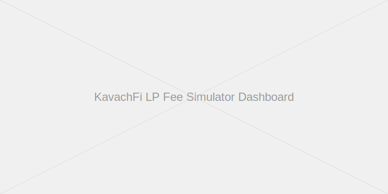

# 🎯 KavachFi LP Fee Simulator

An interactive dashboard for simulating Liquidity Provider (LP) fees and returns on the KavachFi perpetual DEX with CLOB and native insurance on Rise Chain.



## 🚀 Features

- **Dynamic Market Simulation**: Realistic price movements with volatility clustering
- **Interactive Dashboard**: Adjust parameters and see results in real-time
- **Comprehensive Metrics**: APR, revenue breakdown, and volatility analysis
- **Multiple Market Scenarios**: Pre-configured presets for different market conditions
- **Data Export**: Download simulation results for further analysis

## 🛠 Installation

1. Clone the repository:
   ```bash
   git clone https://github.com/yourusername/kavachfi-lp-simulator.git
   cd kavachfi-lp-simulator
   ```

2. Create a virtual environment (recommended):
   ```bash
   python -m venv venv
   source venv/bin/activate  # On Windows: venv\Scripts\activate
   ```

3. Install the required packages:
   ```bash
   pip install -r requirements.txt
   ```

## 🚀 Usage

1. Run the Streamlit app:
   ```bash
   streamlit run app.py
   ```

2. Open your web browser and navigate to `http://localhost:8501`

3. Adjust the simulation parameters in the sidebar and click "Run Simulation"

4. Explore different tabs to analyze the results

## 📊 Features in Detail

### Market Simulation
- Realistic price movements with volatility clustering
- Dynamic trading volume correlated with price volatility
- Liquidation events during high volatility periods

### Fee Calculation
- Trading fees based on volume and fee rate
- Spread revenue from bid-ask spreads
- Dynamic spreads that widen with volatility

### Visualization
- Interactive charts with Plotly
- Multiple chart types (line, bar, scatter, pie)
- Responsive design for different screen sizes

### Data Export
- Download simulation results as CSV
- Complete parameter logging for reproducibility

## 📈 Key Metrics

- **Average APR**: Mean annual percentage return for LPs
- **Peak APR**: Maximum hourly APR during the simulation
- **Total Revenue**: Sum of all fees collected
- **Revenue per $1M LP**: Normalized metric for comparing across pool sizes
- **Projected Annual APR**: Extrapolated APR based on simulation period

## 🤝 Contributing

Contributions are welcome! Please feel free to submit a Pull Request.

## 📝 License

This project is licensed under the MIT License - see the [LICENSE](LICENSE) file for details.

## 📞 Contact

For questions or feedback, please open an issue on GitHub.
